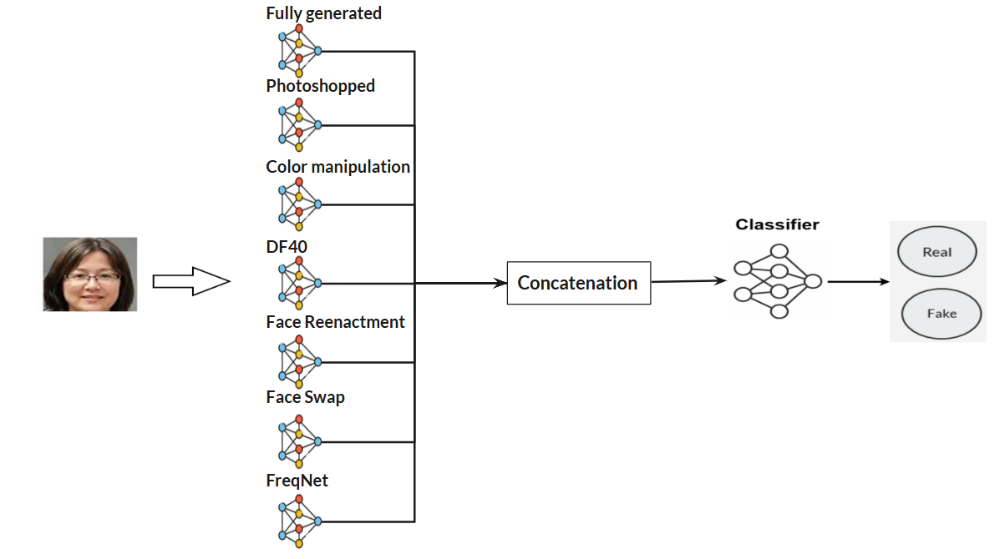

# ImVerif-detector installation Guide

## Overview
ImVerif-detector is an ensemble-based classifier designed to detect whether an image is real or a deepfake. The ensemble combines multiple expert models, each trained to specialize in a particular type of manipulation:

Fully Generated: Detects entirely synthetic images.

Photoshopped: Focuses on subtle retouching and partial modifications.

Color Manipulation: Captures unnatural adjustments to color and lighting.

Facial Deepfakes: Identifies face-swapped or manipulated facial content.

## Estimated Time Requirements
- Model weights download & installation: ~5 minutes

- Virtual environment setup: ~30 minutes

Please ensure that at least **45 GB** of free disk space is available before proceeding with the environment setup and model installation.

**Note**: This code is intended to run exclusively on **Linux systems**.

## System Architecture

The architecture illustrates the pipeline from image input to final ensemble classification. Each specialized model provides an individual prediction, and the ensemble module produces the final verdict.

## 1. Download Pre-trained Model Weights

Before running predictions, you must download the pre-trained model weights.

To download and install the model weights, simply run the following command from the root of the repository:

    bash install_models.sh

This script will automatically:
- Download the models.zip archive from the designated remote storage,
- Unzip its contents,
- And place the resulting models folder inside the ImVerif-detector project directory.

## 2. Set Up the Environment

To install all virtual environments and their required dependencies, run the following script:

    bash install_envs.sh /your/custom/env/base/path

Arguments:

- /your/custom/env/base/path: The absolute path where you want the virtual environments to be created. This directory should have sufficient available disk space (45 GB).

### Example
    bash install_envs.sh "/medias/db/ImagingSecurity_misc/Collaborations/ImVerif-detector/envs"

## 3. Run predictions
### Predict from a Single Image
To run inference on a single image, use the following command:

    bash run_predictions.sh false /path/to/your/image.jpg /your/custom/env/base/path

Arguments:

- false: Indicates that the input is a single image and not a list of image paths.

- /path/to/your/image.jpg: Path to the image file you want to analyze.

- /your/custom/env/base/path: Base directory where the virtual environments were previously installed.

#### Example:
    bash run_predictions.sh false "test/id0_0000/Celeb-real_id1_0004_171.png" "/medias/db/ImagingSecurity_misc/Collaborations/ImVerif-detector/envs"

### Predict from a Text File Containing Image Paths
To run inference on a batch of images listed in a .txt file (one path per line), use:

    bash run_predictions.sh true /path/to/your/file.txt /your/custom/env/base/path

Arguments:

- true: Indicates that the input is a file containing multiple image paths.

- /path/to/your/file.txt: Path to the text file listing all image paths to analyze.
Expected Format of the .txt File:

Each line should contain the absolute path to a single image. For example:

    /medias/db/ImagingSecurity_misc/dataset/images/image_001.jpg
    /medias/db/ImagingSecurity_misc/dataset/images/image_002.jpg
    /medias/db/ImagingSecurity_misc/dataset/images/image_003.jpg

- /your/custom/env/base/path: Base directory where the virtual environments were previously installed.

#### Example:
    bash run_predictions.sh true "test/test.txt" "/medias/db/ImagingSecurity_misc/Collaborations/ImVerif-detector/envs"

After execution, the final prediction results will be saved in: **output/ensemble.csv**

